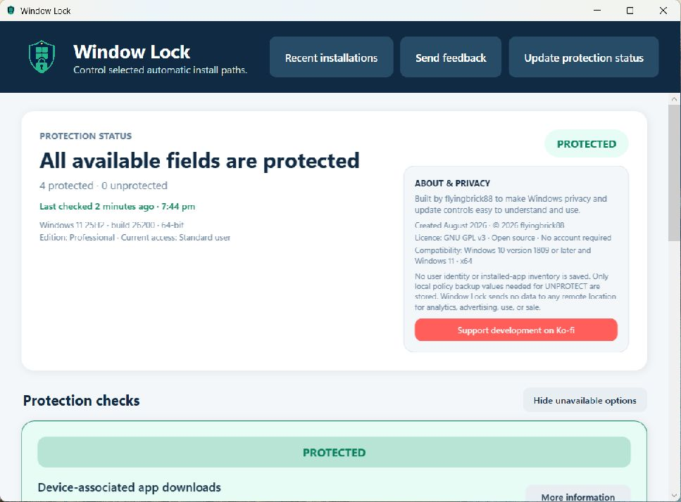

# Window Lock — Windows privacy & update control

[](https://github.com/flyingbrick88/window-lock-privacy/actions/workflows/build.yml)
[](https://flyingbrick88.github.io/window-lock-privacy/)
[](LICENSE)

Window Lock is a Windows 10 and 11 desktop app that makes selected built-in privacy and update policies clear and easy to control. Its main purpose is to reduce optional manufacturer companion apps, promotional utilities, and telemetry software appearing simply because hardware such as a display, printer, or USB device was connected.



## Download

Download `WindowLock-Setup-0.2.0.exe` from the [GitHub releases page](https://github.com/flyingbrick88/window-lock-privacy/releases). The installer is self-contained and installs only for the current Windows account. See [installation guidance](docs/installation.md), including checksum verification and the unsigned-app warning.

## What it checks

- device-associated app downloads triggered through Windows device metadata
- the fallback Device Installation Settings preference
- driver-classified packages in routine Windows quality updates
- notify-before-download behavior for Windows Update
- automatic Microsoft Store app updates
- Microsoft Store access where the policy is supported

Unprotected cards appear first, protected cards are pale green, and unsupported options appear last and can be hidden. Each actionable card has its own **PROTECT** or **UNPROTECT** button. **More information** explains the effect, applicability, current Windows evidence, and Microsoft documentation.

Window Lock will not overwrite a conflicting policy set by another administrator, organization, or tool. It records local backup and ownership metadata before applying a new value, verifies every change, and allows UNPROTECT only while the value still matches what Window Lock set.

## Important limitation

Windows has no universal third-party callback that pauses every possible installation and asks another app for approval. Window Lock does **not** guarantee that nothing can be installed without permission. It does not intercept every traditional installer, initial Plug and Play driver, package manager, script, enterprise-management action, or Windows servicing path. Some controls block automatic delivery and require a later manual update rather than presenting a per-item approval prompt.

Protection can delay driver, Store-app, or security updates. Review and install trusted security updates regularly. See the [user guide](docs/user-guide.md) and [posture details](docs/posture-checks.md).

## Privacy

No account is required. Window Lock contains no analytics, advertising, telemetry, cloud sync, or remote reporting and sends no application data anywhere. It does not save user identity, installed-app inventory, or recent-installation results. It stores only local policy backup values needed for safe UNPROTECT operations. The feedback and documentation buttons merely open the selected website in the default browser. Read the [complete privacy statement](PRIVACY.md).

## Build

Requirements: Windows and .NET SDK 10.0. From PowerShell:

```powershell
dotnet restore .\WindowLock.slnx
dotnet build .\WindowLock.slnx --configuration Release --no-restore
dotnet run --project .\tests\WindowLock.Tests\WindowLock.Tests.csproj --configuration Release --no-build
dotnet publish .\src\WindowLock\WindowLock.csproj --configuration Release --property:PublishProfile=win-x64 --output .\dist\win-x64
& "$env:LOCALAPPDATA\Programs\Inno Setup 6\ISCC.exe" .\installer\WindowLock.iss
```

The GitHub Actions workflow repeats the build, test, publish, and installer compilation on a clean Windows runner.

Release builds also generate an SPDX software bill of materials and SHA-256 checksums. See the public [code-signing policy](CODE_SIGNING_POLICY.md), [SignPath readiness gate](docs/signpath-readiness.md), and [licensing history](docs/licensing-history.md).

## Feedback and security

Use the app's **Send feedback** button or [GitHub Issues](https://github.com/flyingbrick88/window-lock-privacy/issues/new/choose). Please report vulnerabilities privately as described in [SECURITY.md](SECURITY.md).

Development is funded voluntarily through [Ko-fi](https://ko-fi.com/flyingbrick88). Support is optional and never affects app features, privacy, or access.

## Licence

Copyright © 2026 flyingbrick88. Current Window Lock source and version 0.2.0 onward are free and open-source software under the [GNU General Public License version 3 only](LICENSE), identified as `GPL-3.0-only`. The GPL permits use, study, modification, redistribution, and commercial activity, provided its terms are followed; distributors must preserve the licence and provide the corresponding source when required. There is no warranty. Versions 0.1.0 and 0.1.1 remain under the licence shipped with those releases; see [licensing history](docs/licensing-history.md). Third-party notices are listed separately in [THIRD-PARTY-NOTICES.md](THIRD-PARTY-NOTICES.md).
